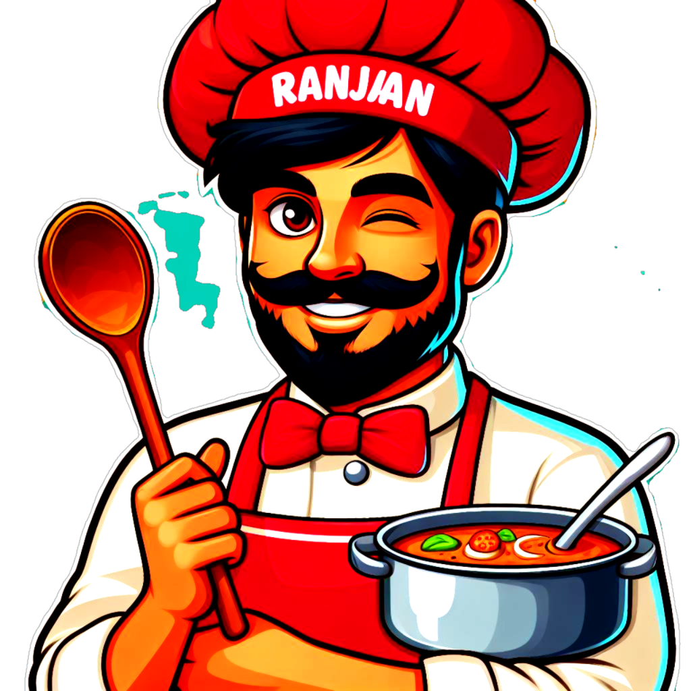

## Ranjan Restro

## Major Components
Header

- Logo
- Nav Items

Body

- Body Container
- Search Bar
- Recipe Container
- Recipe Cards
- Title
- Description
- Image
- Link
Footer
- Footer Container
- Copyright
- Links
- Contact Card
Scroll to top

## Routes

1. / == Home
2. /about-us == About Us
3. /contact-us == Contact Us

## Explored

1. Custom Hooks
2. H.O.C
	1. Used to add a Promoted label
3. Custom LazyLoad wrapper ( in progress )
4. react-router-dom